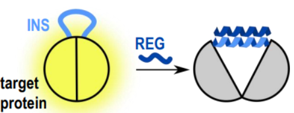

# INSRTR

Regulation of the activity of proteins enables control of complex cellular processes. This platform enables the construction of ON/OFF protein switches, their regulation by small molecules, and Boolean logic functions with a rapid response in mammalian cells.

This repository contains the code to predict optimal regulatory insertion sites. Structures containing regulatory coiled-coils are also predicted using AlphaFold2. The code is also available as a [colab notebook](INSRTR.ipynb). 

For more information please see Plaper, Merljak, Fink et all: https://www.biorxiv.org/content/10.1101/2022.06.03.494683v1

